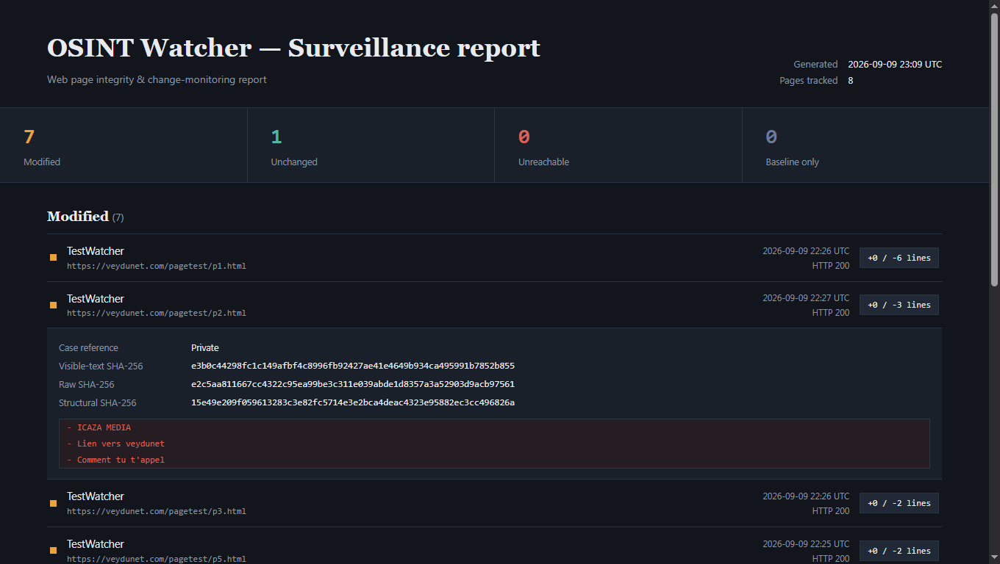

# OSTIUM OSINT Watcher

**Evidence-grade change detection for web pages, built for OSINT investigators.**

Register a list of pages, run a check whenever you need one (or let the app check on a
randomized interval), and get a verdict — *modified*, *unchanged*, or *unreachable* — backed
by layered cryptographic fingerprints and a line-level diff, not a single fragile hash.
Native Windows app, fully offline data storage.

-brightgreen)

## Contents

- [Features](#features)
- [How change detection works](#how-change-detection-works)
- [Security](#security)
- [Getting started](#getting-started)
- [Using the app](#using-the-app)
- [Project structure](#project-structure)
- [Where your data lives](#where-your-data-lives)
- [Known limitations / roadmap](#known-limitations--roadmap)
- [Responsible use](#responsible-use)
- [License](#license)

## Features

- **Four-layer SHA-256 fingerprinting** per check — raw bytes, normalized markup, visible
  text, and DOM structure — so a verdict of "modified" reflects a real content or structural
  change, not ad-banner noise.
- **TLS certificate fingerprinting** on every HTTPS check — catches an infrastructure swap
  even when the page content itself hasn't changed.
- **Line-level diff evidence** (added/removed lines, % changed) attached to every "modified"
  result.
- **Tamper-evident history** — every stored scan is SHA-256 hash-chained; a "Verify
  integrity" button detects if a past entry was altered or deleted outside the app.
- **Manual or randomized-interval checks** — trigger a run on demand, or let a page check
  itself automatically at a jittered interval so requests don't fall into a fixed, easily
  fingerprinted pattern.
- **Five export formats** — Markdown, HTML (the same dark dashboard, as a standalone file),
  JSON (full fidelity), CSV (flat summary), and PDF (rendered natively via WebView2's
  `PrintToPdfAsync` — no third-party PDF library).
- **AES-256-GCM at rest**, key sealed with Windows DPAPI — nothing on disk is readable
  outside your Windows account, and there's no password to manage.
- **SSRF-guarded by default** — resolves DNS and blocks loopback/private/link-local targets
  (including against DNS-rebinding) unless a page explicitly opts out.
- **Zero telemetry.** The only network calls this app ever makes are to the pages you add.

## How change detection works

A single hash is too fragile to call something "changed" responsibly — a rotating ad banner
or a timestamped comment flips a naive byte hash on every check. Each scan records four
independent fingerprints instead:

| Layer | What it hashes | Purpose |
|---|---|---|
| Raw | Exact response bytes | Byte-for-byte integrity, strongest evidentiary value |
| Normalized | Markup with comments/scripts/styles stripped, whitespace collapsed | Filters most incidental noise |
| Visible text | Tag-stripped, decoded visible text only | Best proxy for "did the content a human sees change" |
| Structural | Tag-name skeleton, text removed | Flags layout/structure changes independent of copy edits |

The **Modified / Unchanged** verdict is driven by the visible-text + structural pair, the most
reliable indicator of a real edit. When a page is flagged, an LCS line diff between the
previous and current visible-text snapshots is stored and exported alongside it as evidence.

## Security

- TLS 1.2+ only; certificates are validated normally (no silent downgrade).
- Responses are capped at 25 MB and streamed, so a huge/malicious response can't exhaust memory.
- Fetching is a plain HTTP GET via `HttpClient` — no script execution, ever, against your
  machine, regardless of what a monitored page contains.
- The exported/embedded HTML report is itself hardened: a strict CSP meta tag, everything
  HTML-encoded, and zero external resource references — safe to open later even though it
  may contain text lifted from an untrusted page.
- The whole solution has exactly one third-party package (`Microsoft.Web.WebView2`,
  Microsoft's own). Everything else — hashing, crypto, HTTP, JSON — is BCL only.

## Using the app

1. **Add a page** — URL, an optional label/case reference, and a mode: *Manual* (you trigger
   checks) or *Randomized interval* (auto-checks every N minutes ± jitter%).
2. **Run analysis** — "Run selected" or "Run all" fetches, fingerprints, diffs against the
   last snapshot, and updates the verdict.
3. **Review the dashboard** — the embedded panel shows every page grouped by verdict, with
   hashes and diff evidence expandable per row.
4. **Export** — pick a format from the toolbar dropdown and save. All five formats render
   from the same underlying report, so they never drift out of sync with each other.
5. **Verify integrity** — select one or more pages and check that their local evidence chain
   hasn't been tampered with since it was recorded.

## Where your data lives

Everything is stored locally at `ApplicationStartup\OsintWatcher` — the DPAPI-sealed key, the
encrypted page list, and one encrypted, hash-chained history file per monitored page. Nothing
is written anywhere else, and nothing ever leaves the machine except requests to the pages
you've added.

## Known limitations / roadmap

- `NavigateToString` (used for the live dashboard and for PDF rendering) has a practical size
  ceiling around 2 MB of HTML — a very large watchlist with long history could hit this in
  the *preview*; the exported `.html` file itself has no such limit. Worth double-checking
  against the current WebView2 SDK version if you grow past a few hundred pages.
- HTML parsing for fingerprinting/diffing is regex-based by design, to keep `Core`
  dependency-free — precise for well-formed markup, but a page that deliberately serves
  malformed HTML to evade detection could confuse the structural layer.

## Responsible use

This tool fetches pages exactly the way a browser would (a single HTTP GET) and is meant for
monitoring pages you have a legitimate reason to watch. It respects standard web etiquette
(a minimum per-domain delay between requests) but does **not** bypass authentication,
rate-limiting, or access controls, and the SSRF guard is on by default specifically to avoid
turning it into a scanner against internal infrastructure. Respect the target's terms of
service and applicable law in your jurisdiction.

## License

MIT
